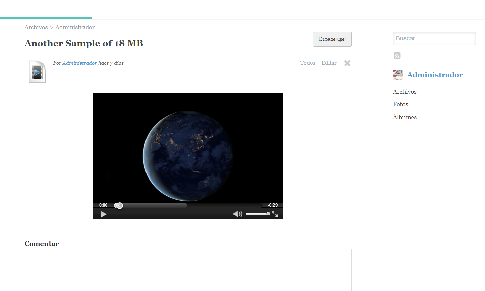

# Nubesoplayer for Elgg 2.3.xx

## Installation

* Clone this repository: https://github.com/rjcalifornia/nubesoplayer.git
* Sign into Elgg with the Administrator account
* Open the Administration Dashboard
* Go to menu "Configure -> Plugins"
* Make sure the Files plugin is activated
* Place the Nubeso Player plugin at the end of the plugin list and activate it
* Run upgrade.php